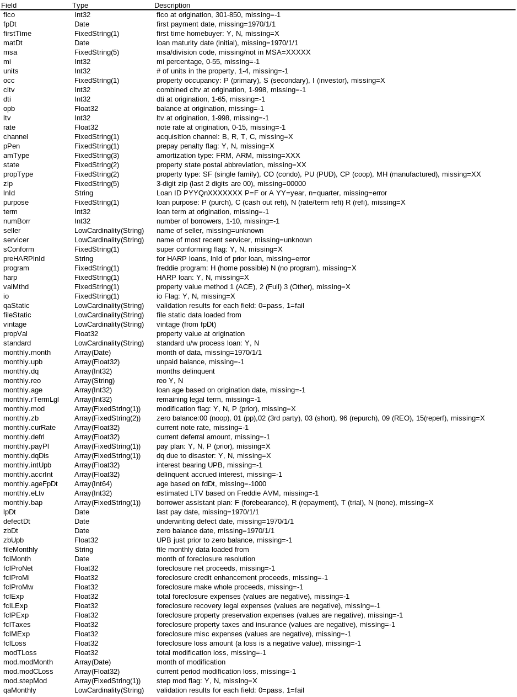

### package freddie

This package imports the loan-level historic data into ClickHouse. A single table is built.  Time-varying fields 
are held in nested arrays in this table.

The package performs QA on the data as well as adding a handful of extra fields:

    - vintage (e.g. 2010Q2)
    - standard - Y/N field, Y = standard process loan
    - loan age based on first pay date
    - numeric dq field
    - reo flag
    - property value at origination
    - file names from which the loan was loaded
    - QA results. There are three sets of fields:
          - The nested table qa that has two arrays:
                - field.  The name of a field that has validation issues.
                - cntFail. The number of months for which this field failed qa.  For static fields, this value will be 1.
           - allFail.  An array of field names which failed for qa.  For monthly fields, this means the field failed for all months.

The command-line parameters are:

    -host   
        ClickHouse IP address. Default value: 127.0.0.1
    -user <user>
        ClickHouse user
    -password <password>
        ClickHouse password for user. Default value: default
    -table <db.table>
       ClickHouse table in which to insert the data. Default value: <none>
    -create <Y|N>
        if Y, then the table is created/reset. Default value: Y
    -dir <path>
        directory with Freddie Mac text files
    -tmp <db>
        ClickHouse database to use for temporary tables
    - concur <num>
        # of concurrent processes to use in loading monthly files. Default value: 1
    -memory <numb>
        max memory usage by ClickHouse.  Default: 40000000000.
    -groupby <num> 
        max_bytes_before_external_groupby ClickHouse parameter. Default: 20000000000.

Since the standard and non-standard data provided by Freddie Mac have the same format, both sets can be imported
by this code either as a single table or two tables.  To create a single table, run the app with 

   -create Y

for the first data source (*e.g.* standard) and

   -create N

for the second data source.

A "DESCRIBE" of the table created by this package is yeidls:

The data is available [here](https://www.freddiemac.com/research/datasets/sf-loanlevel-dataset).