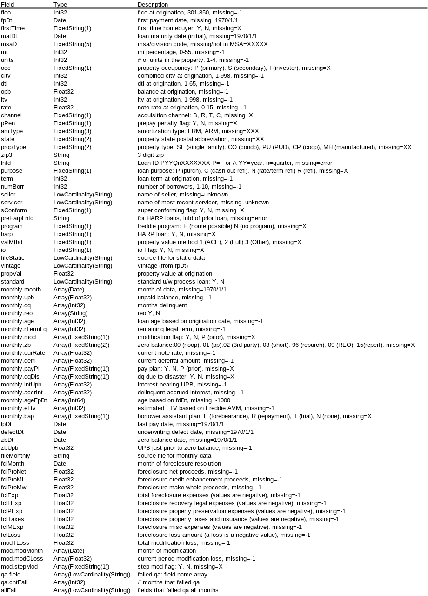

### package freddie
This package imports the loan-level historic data into ClickHouse. A single table is built.  Time-varying fields 
are held in nested arrays in this table.

The package performs QA on the data as well as adding a handful of extra fields:

    - loan age based on first pay date
    - numeric dq field
    - reo flag
    - vintage (e.g. 2010Q2)
    - property value at origination
    - file names from which the loan was loaded
    - QA results
         - There are two fields -- one for monthly data and one for static data.
         - The QA results are in keyval format: <field name>:<result>.  result: 0 if pass, 1 if fail.

The command-line parameters are:

    -host   
        ClickHouse IP address
    -user <user>
        ClickHouse user
    -password <password>
        ClickHouse password for user
    -table <db.table>
       ClickHouse table in which to insert the data
    -create <Y|N>
        if Y, then the table is created/reset.
    -dir <path>
        directory with Freddie Mac text files
    -tmp <db>
        ClickHouse database to use for temporary tables

Since the standard and non-standard data provided by Freddie Mac have the same format, both sets can be imported
by this code either as a single table or two tables.  To create a single table, run the app with 

  -create Y

for the first data source (*e.g.* standard) and

   -create N

for the second data source.

A "DESCRIBE" of the table created by this package is yeidls:

The Freddie data is available [here](https://www.freddiemac.com/research/datasets/sf-loanlevel-dataset).